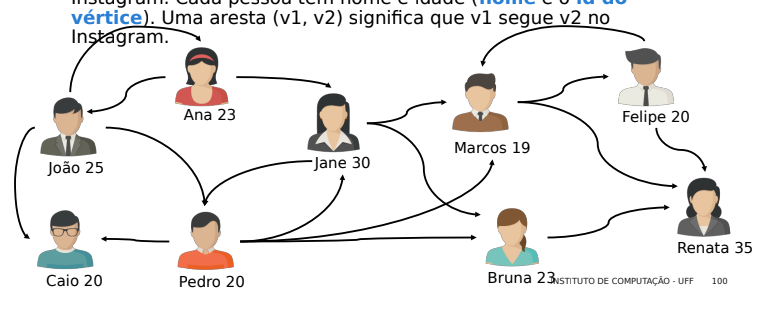

(1) Exercícios de grafos do Instagram e do Facebook.

---

EXERCÍCIOS
Considere o grafo a seguir, que representa seguidores no
Instagram. Cada pessoa tem nome e idade (nome é o id do
vértice). Uma aresta (v1, v2) significa que v1 segue v2 no
Instagram.

EXERCÍCIOS

Implementar funções em C para responder às seguintes questões:
1. Quantas pessoas uma determinada pessoa segue?
int numero_seguidos(TGrafo *g, char *nome);
2. Quem são os seguidores de uma determinada pessoa? (função
imprime os nomes dos seguidores, caso a flag imprime seja
True, e retorna quantidade de seguidores)
int seguidores(TGrafo *vertice, char *nome, int imprime);
3. Quem é a pessoa mais popular? (tem mais seguidores)
TGrafo *mais_popular(TGrafo *g);

INSTITUTO DE COMPUTAÇÃO - UFF 101

EXERCÍCIOS

4. Quais são as pessoas que só seguem pessoas mais velhas do
que ela própria? (função imprime os nomes das pessoas, caso a
flag imprime seja True, e retorna quantidade de pessoas)
int segue_mais_velho(TGrafo *g, int imprime);

---

(2) Dados um grafo e dois nós (x e y), retorne um caminho arbitrário entre x e y. Se não houver caminho, o retorno é NULL: TLSE *caminho (TG *g, int x, int y).

(3) Dado um grafo conectado, verifique se ele pode ser transformado em uma árvore binária. Se ele for uma árvore binária, retorne um. Se não, retorne zero. DICA: use TLSE para resolver esta questão: int teste (TG *g).

(4) Escreva o algoritmo de ordenação por bolha em arquivos binários compostos por inteiros - void BolhaBin(char *nomeArq).

(5) Escreva o algoritmo de ordenação por inserção em arquivos binários compostos por inteiros - void insertSort(char *nomeArq).